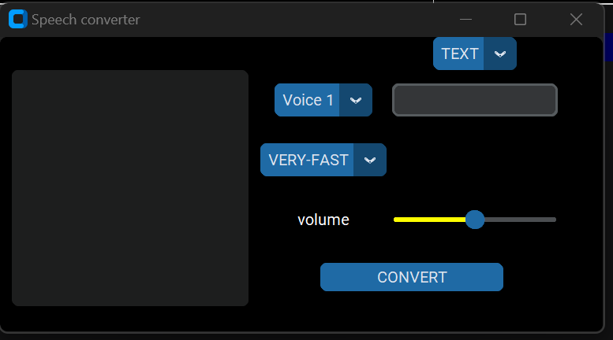

# Text_To_Voice

It contain the files which i created for my friends to help them in there prject it can contain any type of project which where created by me but in a very short period of time

<h2><b>Introduction</b></h2>

In today's fast-paced digital world, accessibility and convenience are paramount. The Text-to-Speech (TTS) project aims to bridge the gap between written text and audible communication, transforming text into natural-sounding speech. This technology has vast applications, from aiding visually impaired individuals to enhancing user experience in smart devices and applications.

<h2><b>Features</b></h2>
<ol>
  <li><b>Voices :</b> It contains different types of Voices for the text file or typed text.</li>
  <li><b>Input :</b> The text which we want to convert can be provided in the written format or the path for the text path.</li>
  <li><b>Speed :</b> The speed of the audio out can be changed also for the GUI only.</li>
  <li><b>Volume :</b> The volume of output obtained can be increased from the GUI only.</li>
</ol>
<h2><b>Screen-Shots</b></h2>

 
<b>GUI {Graphic User Interface}</b>

<h2><b>Thoughts</b></h2>
<footer>
  

    "Architecting robust and scalable backend systems, where data flows seamlessly and logic thrives."
  

</footer>
